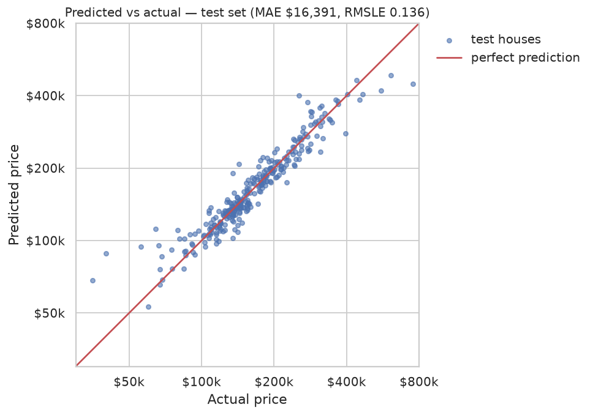
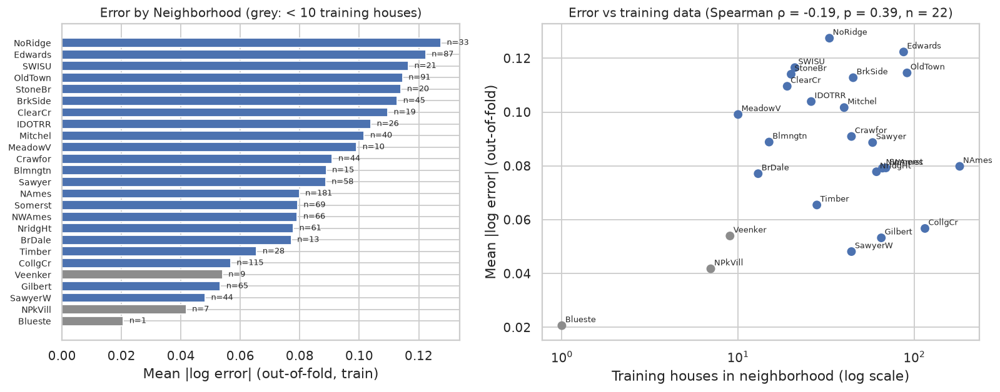

# Ames House Price Prediction

Predicting house sale prices on the Ames, Iowa dataset with a leakage-safe scikit-learn pipeline, nested cross-validation, a single test-set evaluation, and an error analysis that measures where the model fails.

[](https://github.com/diyor-ai/house-price-prediction/actions/workflows/ci.yml)

## Results

Held-out test set: 292 houses (20% split, `random_state=42`), evaluated once after the model was chosen by cross-validation on the other 80%.

| model | test MAE ($) | test RMSLE |
|---|---|---|
| Median baseline (always predict the training median) | 59,568 | 0.432 |
| Linear regression, 5 features | 25,415 | 0.264 |
| Linear regression, 5 features, log1p target | 20,742 | 0.174 |
| **HistGradientBoosting (final model)** | **16,391** | **0.136** |

The final model has test R² 0.875 and a median error of 5.9% per house. Its cross-validated RMSLE was 0.129 ± 0.016, consistent with the test result. The model was chosen by a rule fixed beforehand: lowest nested-CV RMSLE among all Stage 3 configurations. Full tables: [`reports/results.md`](reports/results.md).

### Model comparison (nested 5-fold CV on the training split, outliers kept)

| model | CV MAE ($) | CV RMSLE | CV R² |
|---|---|---|---|
| Median baseline | 54,586 ± 2,677 | 0.390 ± 0.018 | -0.046 ± 0.014 |
| Linear regression, 5 features | 24,633 ± 1,375 | 0.460 ± 0.360 | 0.746 ± 0.060 |
| Linear regression, 5 features, log1p target | 22,638 ± 2,200 | 0.178 ± 0.029 | 0.386 ± 0.758 |
| Ridge | 17,321 ± 1,405 | 0.140 ± 0.029 | 0.652 ± 0.399 |
| Lasso | 17,753 ± 1,555 | 0.146 ± 0.028 | 0.525 ± 0.550 |
| RandomForest | 16,699 ± 1,104 | 0.137 ± 0.015 | 0.857 ± 0.038 |
| **HistGradientBoosting** | **15,899 ± 736** | **0.129 ± 0.016** | **0.870 ± 0.036** |

Differences between the top models (e.g. RMSLE 0.129 vs 0.137) are smaller than the fold-to-fold standard deviation, so the ranking among them is not firm. The huge R² spreads of the linear models come from folds that contain the two outliers.




## What I found

- **NaN usually means "absent", not "missing".** 15 of the 19 columns with missing values describe features a house may simply not have (no pool, garage, basement, fireplace). They become an explicit `"None"` category instead of being imputed. Only `LotFrontage`, `MasVnrType/Area` and `Electrical` are truly missing.
- **A pandas trap:** the default CSV parser reads the string `"None"` as NaN, but in `MasVnrType` it is a real category (more than 800 houses). The loader keeps it, and a unit test guards it.
- **log1p target + linear model = occasional blow-ups.** The log-target linear baseline has the better RMSLE (0.178 vs 0.460) but a worse CV R² (0.386 vs 0.746), driven by the folds that contain the two huge-house outliers, where `expm1` amplifies extrapolation errors into huge dollar errors (worst-fold R² -1.11).
- **Outlier experiment** (2 huge but cheap partial sales, removed from *training folds only*): for Ridge it cut CV MAE from $17,321 to $16,409 and RMSLE on typical houses from 0.121 to 0.113; for RandomForest and gradient boosting it made no measurable difference (RMSLE 0.129 vs 0.129 for HistGradientBoosting). The trade-off: removing them helps linear models on typical houses, but those models then never see giant houses. The selection rule picked the configuration with the outliers kept (tied at RMSLE 0.129).
- **Neighborhood data scarcity is only partly to blame for errors.** Across 22 neighborhoods with at least 10 training houses, median % error falls with training count (Spearman rho -0.65, p = 0.001), but mean |log error| does not (rho -0.19, p = 0.39). Houses in neighborhoods with fewer than 30 training houses have a median error of 7.7% vs 5.9%. The largest dollar errors are in expensive, varied neighborhoods (NoRidge, StoneBr, NridgHt), so scarcity is confounded with price level.
- **The worst predictions are cheap houses sold under unusual conditions.** 9 of the 10 worst test predictions are over-predictions, 60% were non-"Normal" sales (vs 18% of the rest), and these 10 houses cause 49% of the total squared log error. Details: [`reports/insights.md`](reports/insights.md).

## Approach

```
fixed 80/20 split (random_state=42)
        |
        v   train only (1,168 houses)                     test (292) untouched
5-fold CV, nested: tuning grid search inside every fold          |
        |                                                         |
        v                                                         |
Pipeline (fitted on training rows only):                          |
  add_features -> LotFrontage by Neighborhood median ->           |
  ColumnTransformer[numeric: median impute + scale,               |
                    categorical: most-frequent impute + one-hot]  |
  -> model, with target log1p(price)                              |
        |                                                         |
        v                                                         |
rule: pick lowest CV RMSLE  ------>  refit on all train  ------>  evaluate ONCE
```

Models: Ridge, Lasso, RandomForest, HistGradientBoosting (small grids), each with and without outlier removal, plus the baselines. Feature engineering (`src/features.py`): TotalSF (all floors + basement), HouseAge and YearsSinceRemodel (age at sale), TotalBath (half baths count 0.5), HasGarage/HasPool/HasFireplace flags, quality grades as ordinals (None < Po < Fa < TA < Gd < Ex), `MSSubClass` treated as a category.

## Design decisions

- **log1p target:** prices are right-skewed (skew 1.74 raw, 0.12 after log1p), so squared error would be dominated by expensive houses; log errors are relative and match the Kaggle metric (RMSLE).
- **Cross-validation, then one test evaluation:** model choice uses nested CV on the training split only, so the test set can give an unbiased final number. All preprocessing lives inside the pipeline and is refitted per fold.
- **Outliers removed from training folds only:** validation and test rows are never filtered, so the with/without comparison is scored on identical houses.
- **Several metrics:** MAE in dollars is easy to read, RMSE punishes big misses, RMSLE measures relative error. They can disagree (see the log-target baseline).

## Tests

`pytest` covers the data shape and key columns, the preserved `"None"` category, a deterministic split, every feature function, leakage checks (statistics learned from train only; CV never fits on validation rows; outliers dropped only from fitting data) and a fast end-to-end run of `python -m src.train --sample`. CI runs them on every push.

## How to run

```bash
conda create -n housing python=3.11 -y && conda activate housing
pip install -r requirements.txt
python -m src.train        # CV, model selection, single test evaluation -> reports/ (a few minutes)
pytest                     # unit tests + fast end-to-end run (python -m src.train --sample)
```

The dataset is downloaded from OpenML on first use and cached in `data/`; if that fails, put Kaggle's `train.csv` into `data/`. Notebooks in `notebooks/` read the files written by `src.train`.

## Project structure

```
src/            data.py features.py models.py evaluate.py train.py insights.py plotting.py
notebooks/      01_eda.ipynb, 04_error_analysis.ipynb
reports/        results.md, insights.md, figures/, predictions and CV tables (CSV)
tests/          data, features, leakage, end-to-end sample run
foundations/    early NumPy / Pandas practice scripts
```

## Limitations

- One dataset: Ames, Iowa, 2006-2010. No claim about other cities or markets.
- The split is random, not time-based, so the model never has to predict a future market.
- Some neighborhoods have very few houses (smallest: 1 in train), so their errors are not reliable.
- Hyper-parameter grids are small; for RandomForest and gradient boosting the best values sit at the edge of the grid (`max_features=0.3`, `min_samples_leaf=1`, `max_depth=3`), so a wider search might help a little.
- Only 292 test houses, and top models are within fold-to-fold noise of each other (see the comparison table).
- Features are what the dataset provides; no listing text, photos or exact location.

## Foundations

`foundations/` holds the first scripts of this project: NumPy vector and matrix operations (including a loop-vs-vectorized timing comparison), numerical gradients and the chain rule, and Pandas loading and missing-value handling. They are the starting point for the pipeline above.

## Dataset

De Cock, D. (2011). *Ames, Iowa: Alternative to the Boston Housing Data as an End of Semester Regression Project.* Journal of Statistics Education, 19(3). Used through the Kaggle competition [House Prices: Advanced Regression Techniques](https://www.kaggle.com/c/house-prices-advanced-regression-techniques) (also on OpenML).
